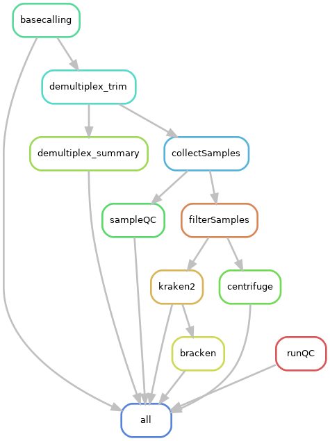

This is an experimental snakemake pipeline to carry out the entire analysis of my Chronic Pancreatitis (CP) microbiome data and obtained by nanopore sequencing.

> This is not intended to be a ready to use pipeline and I doubt that I will be revisiing it for updates in the future. I learnt Snakemake from scratch through the course of this project and would have found a repo like this immensely useful. That is the main motivation I had to create this repository. Most of the code can be easily understood and reused. 

The pipeline includes, data organization, QC, Basecalling (Guppy for nanopore), Demultiplexing, Trimming and filtering, Taxonomic classification (using Kraken2 and Centrifuge) and a seperate script for data analysis which can be called by a different rule.

# Tools used

Below is a list of tools used by this pipeline with a link to their page/repo where information about installation and usage can be found. 

- [Guppy](https://denbi-nanopore-training-course.readthedocs.io/en/latest/basecalling/basecalling.html) (you need to be part of the nanopore community for access to official docs and [download](https://community.nanoporetech.com/downloads))
- [NanoPlot](https://github.com/wdecoster/NanoPlot)
- [qcat](https://github.com/nanoporetech/qcat)
- [Kraken 2](https://ccb.jhu.edu/software/kraken2/index.shtml?t=manual)
- [Centrifuge](https://ccb.jhu.edu/software/centrifuge/)

If anybody will find this useful if polished, please let me know. Also, if you are a veteran and somehow come across this repo I will be thrilled to hear your sugesstions and more so if someone has the time to help me polish it. Finally, if you find any part of this repo useful for your work, do let me know. I will be very happy to hear!

#############################################################################################################################

Information about output and input formats are currently mentioned as comments in the code. (I will eventually add all the relevant information here)

directory structure of output as a classification 
classified 
└── <sample#> 
    ├── bracken 
    ├   ├── genus_report 
    ├   └── species_report 
    ├── centrifuge 
    ├   ├── report 
    ├   └── result 
    ├── kraken2_BacArchViFunProt 
    ├   ├── report 
    ├   └── result 
    ├── kraken2_humandb 
    ├   ├── report 
    ├   ├── result 
    ├   └── unclassified 
    └── kraken2_Minidb 
        ├── report 
        └── result 
